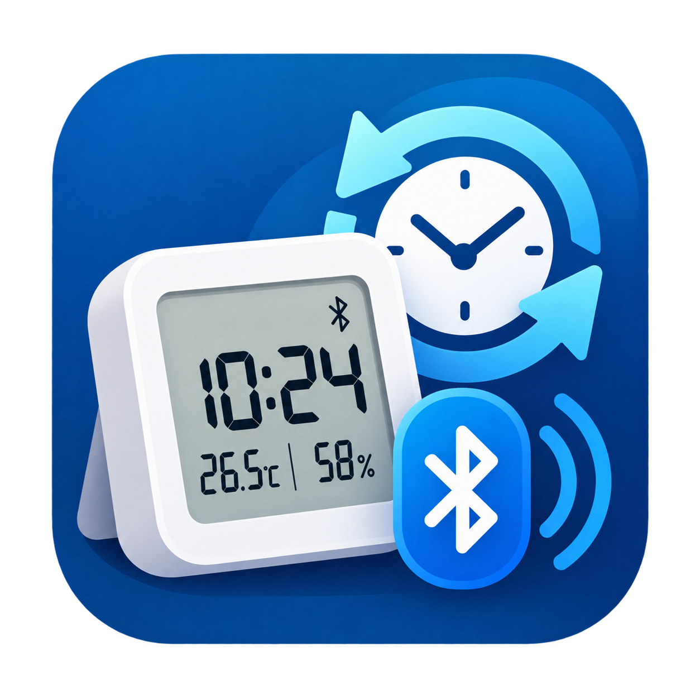

# BLE Clock Sync



Home Assistant BLE clock synchronization · Home Assistant 藍牙時鐘校時

[繁體中文](#繁體中文) · [English](#english)

## 繁體中文

透過 Home Assistant 本機藍牙或**已啟用主動連線的 ESPHome Bluetooth Proxy**，
為小米、PVVX 與青萍 CGD1 時鐘校時。支援 HACS 安裝，不需要修改 `configuration.yaml`。

### 支援裝置

| 裝置 | 韌體 | 驗證狀態 |
|---|---|---|
| MJWSD05MMC | PVVX | 已有使用者實機校時成功回報 |
| LYWSD02 / LYWSD02MMC | 原廠，使用五位元組時間格式 | 協定模擬測試通過，待實機驗證 |
| MHO-C303 | 原廠，符合小米服務與五位元組時間格式 | 協定模擬測試通過，待實機驗證 |
| 其他具備時鐘功能的 PVVX 裝置 | 提供 1F10/1F1F 與 0x23 指令 | 協定模擬測試通過，需依型號驗證 |
| 青萍 CGD1 | 原廠 | 已實作 token 驗證與校時，待實機驗證 |

MJWSD05MMC 原廠韌體、PIN 保護的 PVVX GATT 目前不支援。
MJWSD05MMC PVVX 的實機成功回報日期為 2026-10-01；未提供確切韌體版本、
連線路徑及完整回歸結果。模擬測試通過不代表所有韌體版本均已實機驗證。

### 安裝

需求：**Home Assistant 2026.9.4 或更新版本**，以及可主動連線的藍牙介面。
目前自動化測試使用 HA 2026.9.4；較舊版本未驗證。

1. HACS → 自訂儲存庫，加入 `https://github.com/xangin/ble-clock-sync`，類別選「整合」。
2. 下載 **BLE Clock Sync**，重新啟動 Home Assistant。
3. 設定 → 裝置與服務 → 新增整合 → **BLE Clock Sync**。
4. 選擇 HA 已發現的時鐘，或確認自動發現的裝置；完成設定後會立即嘗試校時。
5. 到整合選項設定排程。廣播名稱為 `ATC_…` / `BTH_…` 等通用名稱時，請指定實際硬體型號。

手動安裝：將 `custom_components/ble_clock_sync` 複製到 HA 的
`config/custom_components/`，重新啟動後新增整合。

找不到裝置時，先確認 HA 藍牙能看見它。部分 PVVX 韌體需要按裝置按鈕開啟連線。
只有被動廣播接收能力的 Proxy 無法完成校時。

### 功能與排程

- 「立即校時」按鈕，以及上次同步、下次同步、時鐘協定、韌體類型、同步狀態、上次同步結果感測器。
- 手動、每日（預設 04:00）、每週與五欄 Cron 排程，例如 `0 */6 * * *`。
- 使用 HA 時區，偵測時區及夏令時間變更。CGD1 的特殊時區限制見下方。
- 自動成功校時間隔至少一小時；手動校時與時區修正除外。
  一般失敗依 5／15／30／60 分鐘退避重試，離線時等待裝置重新出現。
- 同一時間只連線一個時鐘；同步狀態、協定快取與重試期限會保留到下次啟動。
- 小米／PVVX 讀回時間驗證容許誤差為 10 秒；CGD1 使用時間指令 ACK 與時區讀回確認。

僅提供校時，不建立溫濕度、電量、鬧鐘或顯示設定實體。感測資料可繼續使用 Xiaomi BLE / BTHome。
廣播加密的 bindkey 與 GATT 配對憑證不同；本整合不需要 MiBeacon / BTHome bindkey。

### CGD1：自動產生 token

1. 新增 CGD1 後，在 token 欄位**留空並送出**，即可為未配對／已解除配對的裝置產生隨機 token。
   系統會先保存 token，再嘗試綁定與校時。
2. 已配對的 CGD1 需要原 token（32 個十六進位字元）。沒有原 token 時，
   請先透過原 App 或依裝置說明解除配對，再產生新 token；本整合不會自動重設時鐘。
3. 若顯示「需要驗證」，可到整合選項選「更換 CGD1 配對 token」。更換後保留排程並重新嘗試。
   訊號不良也可能導致驗證逾時，請先檢查連線。

自動產生 token 是建立新的配對憑證，**不是讀出既有 token**。
Token 存在 HA config entry，不會包含於本整合診斷或同步歷史；請勿公開 config entry 檔案。
避免其他 App 或整合同時校時或使用不同 token 控制裝置。

校時前會先讀設定，只更新時區，保留鬧鐘、亮度、音量等其他欄位。
CGD1 時區精度為六分鐘：UTC+8、UTC-5、UTC+5:30 可精確表示，UTC+5:45 會截為 UTC+5:42。
目前尚無已確認的時間讀取指令，因此成功狀態不代表實際量測過時鐘誤差。
詳見 [CGD1 設定與驗證指南](docs/CGD1_SETUP.md)。

### 升級與疑難排解

從 v0.1.0 升級至 v0.2.0 後重新啟動 HA，原裝置及排程會保留。
已移除 `clock_drift`，舊實體會自動清除；校時按鈕使用 `mdi:clock-sync` 圖示。

需要紀錄時，在整合選單啟用偵錯記錄、重現一次校時，再停用並下載記錄。
分享前請遮蔽藍牙位址與連線來源識別資訊。驗證錯誤或未知協定格式修正後，請手動重試。
回報問題請附型號、韌體、HA 版本、本機藍牙／Proxy、時區與實體顯示結果，勿提供 token。

## English

Synchronize Xiaomi, PVVX and Qingping CGD1 clocks through Home Assistant's local
Bluetooth adapter or an **ESPHome Bluetooth Proxy with active connections enabled**.
Install through HACS; no `configuration.yaml` changes are required.

### Supported devices

| Device | Firmware | Validation |
|---|---|---|
| MJWSD05MMC | PVVX | User-reported real-hardware sync success |
| LYWSD02 / LYWSD02MMC | Stock with readable five-byte time | Mock protocol tests passed; hardware validation pending |
| MHO-C303 | Stock with matching Xiaomi service and five-byte time | Mock protocol tests passed; hardware validation pending |
| Other clock-capable PVVX devices | 1F10/1F1F service and command 0x23 | Mock protocol tests passed; validate each model |
| Qingping CGD1 | Stock | Token authentication and clock sync implemented; hardware validation pending |

MJWSD05MMC stock firmware and PIN-protected PVVX GATT are currently unsupported.
The MJWSD05MMC PVVX success report dates to 2026-10-01; exact firmware, connection
path and full regression results were not supplied. Mock tests do not establish
hardware compatibility across all firmware variants.

### Installation

Requires **Home Assistant 2026.9.4 or later** and an active Bluetooth connection path.
Automated tests currently target HA 2026.9.4; older releases are unverified.

1. HACS → Custom repositories → add `https://github.com/xangin/ble-clock-sync`, category **Integration**.
2. Download **BLE Clock Sync** and restart Home Assistant.
3. Settings → Devices & services → Add integration → **BLE Clock Sync**.
4. Select a clock already discovered by HA, or confirm Bluetooth discovery. Setup triggers the first sync.
5. Configure the schedule in Options. For generic `ATC_…` / `BTH_…` names, choose the actual hardware model.

For manual installation, copy `custom_components/ble_clock_sync` into HA's
`config/custom_components/`, restart and add the integration.

If the clock is missing, check HA Bluetooth discovery first. Some PVVX firmware
requires a button press to allow connections. Passive-only proxies cannot sync clocks.

### Features and scheduling

- **Sync time** button; **Last sync**, **Next sync**, **Clock protocol**, **Firmware family**,
  **Sync status** and **Last sync result** sensors.
- Manual, Daily (default 04:00), Weekly and five-field Cron schedules, such as `0 */6 * * *`.
- HA timezone is the time source, with timezone and DST change detection. See CGD1's timezone limitation below.
- At least one hour between successful automatic syncs, except manual requests and timezone corrections.
  Ordinary failures use 5/15/30/60-minute backoff; offline devices wait for discovery.
- One clock connection at a time. State, protocol cache and retry deadlines survive restarts.
- Xiaomi/PVVX verify clock read-back within 10 seconds. CGD1 verifies the time-command ACK and timezone read-back.

This integration only synchronizes clocks. Use Xiaomi BLE / BTHome for temperature,
humidity and battery sensors. No alarm or display-setting entities are created.
Advertisement encryption differs from GATT authentication: MiBeacon / BTHome bindkeys are not required.

### CGD1: automatic token generation

1. **Leave the token field empty and submit** to generate a random token for an unpaired
   or unbound clock. The credential is saved before attempting binding and clock sync.
2. Already-paired clocks require their existing token (32 hexadecimal characters).
   Without it, unpair through the original app or the device's instructions before
   generating a new token. The integration never resets the clock automatically.
3. To recover from **Authentication required**, select **Change CGD1 pairing token**
   in Options. Existing schedules are preserved and synchronization is retried.
   Poor radio conditions can also cause authentication timeouts, so check connectivity first.

Automatic generation creates a new pairing credential; **it does not retrieve an existing token**.
The token is stored in the HA config entry, excluded from this integration's diagnostics
and sync history. Do not share config-entry files. Avoid competing time writers or controllers using different tokens.

Before writing the timezone, the handler reads settings and preserves other fields,
including alarms, brightness and volume. CGD1 uses six-minute timezone increments:
UTC+8, UTC-5 and UTC+5:30 are exact; UTC+5:45 truncates to UTC+5:42.
No clock-time read command is verified, so a successful sync does not claim a measured clock error.
See the [CGD1 setup and validation guide](docs/CGD1_SETUP.md).

### Upgrades and troubleshooting

Restart HA after upgrading from v0.1.0 to v0.2.0. Existing entries and schedules remain.
The obsolete `clock_drift` entity is removed automatically. The sync button uses `mdi:clock-sync`.

Enable debug logging from the integration menu, reproduce one sync, then disable logging
and download the log. Redact Bluetooth addresses and source identifiers before sharing.
Authentication and unsupported-format failures require a manual retry after correction.
Include the model, firmware, HA version, adapter/proxy, timezone and physical display result in reports; never include tokens.

## Development / 開發

```sh
python3.14 -m venv .venv
.venv/bin/python -m pip install -r requirements-test.txt
.venv/bin/pytest
.venv/bin/ruff check .
.venv/bin/ruff format --check .
.venv/bin/mypy custom_components
.venv/bin/python scripts/validate_package.py
```

Tests exercise HA setup and lifecycle with mocked Bluetooth; no hardware is needed.
CI runs tests, type/lint checks, hassfest and the HACS validator.
測試使用模擬藍牙，無須實機；實際相容性仍須硬體驗證。

[Architecture / 架構](docs/ARCHITECTURE.md) · [Protocol evidence / 協定依據](docs/PROTOCOLS.md) ·
[Hardware validation / 實機驗證](docs/HARDWARE_VALIDATION.md)

## Credits and license / 致謝與授權

[MIT License](LICENSE). Architecture and integration scaffolding adapted from
[drslid/LYWSD02_BLE_Dashboard](https://github.com/drslid/LYWSD02_BLE_Dashboard/tree/feature/home-assistant-clock-sync).
Clock protocol references: [koenvervloesem/bluetooth-clocks](https://github.com/koenvervloesem/bluetooth-clocks)
and [pvvx/ATC_MiThermometer](https://github.com/pvvx/ATC_MiThermometer).
CGD1 authentication, settings and time commands adapted from
[rjocoleman/ha-qingping-cgd1](https://github.com/rjocoleman/ha-qingping-cgd1) and
[rjocoleman/qingping-cgd1](https://github.com/rjocoleman/qingping-cgd1).

感謝上述專案提供架構與協定參考。作者授權聲明保留於 LICENSE；來源版本詳見協定文件。
All connections use Home Assistant's Bluetooth transport; upstream standalone scanners are not used.
